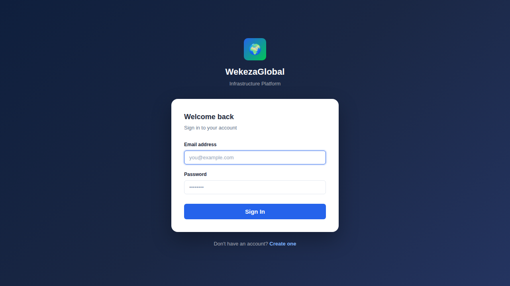
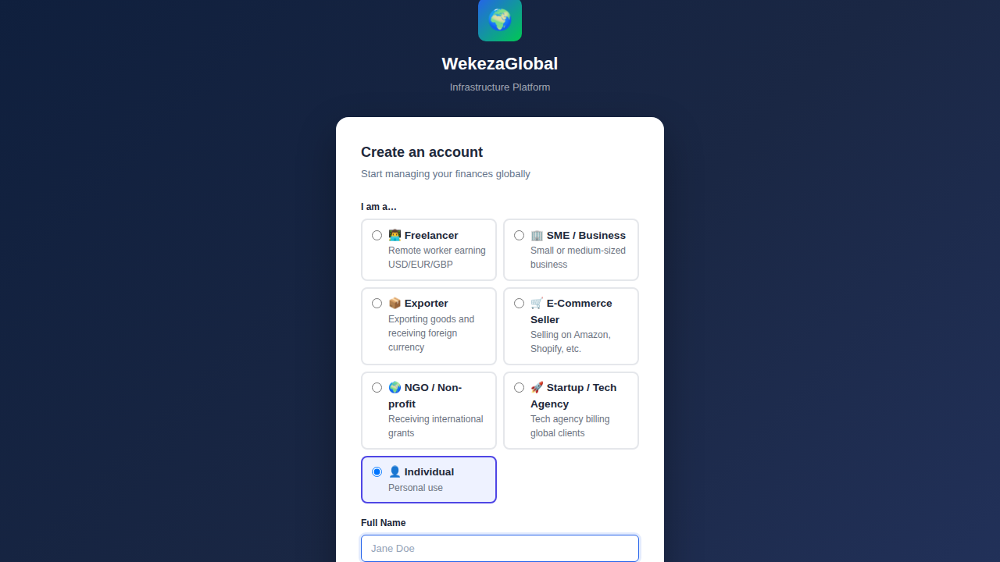
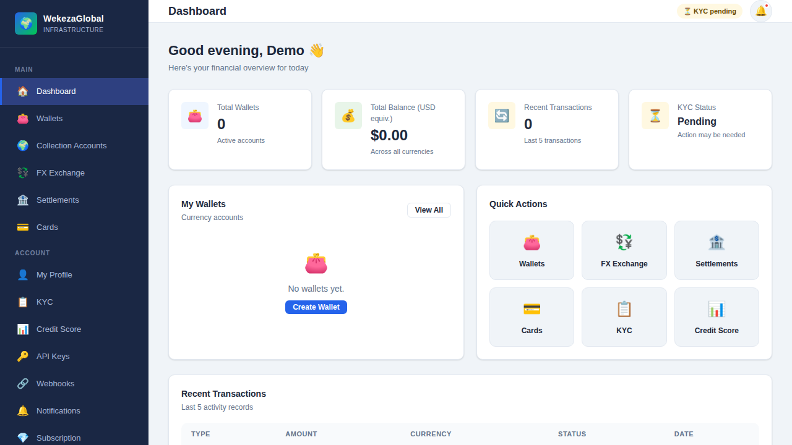
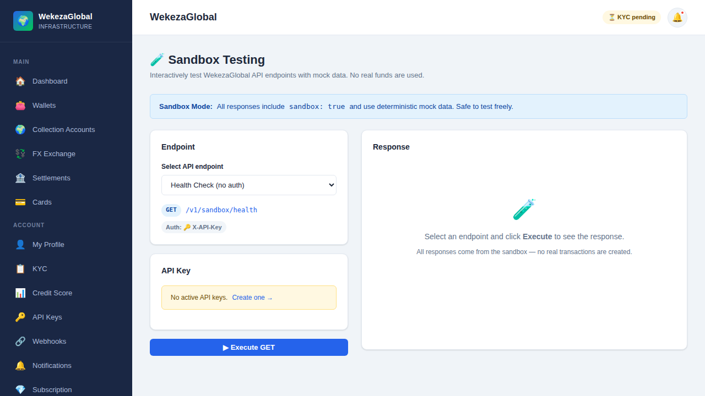
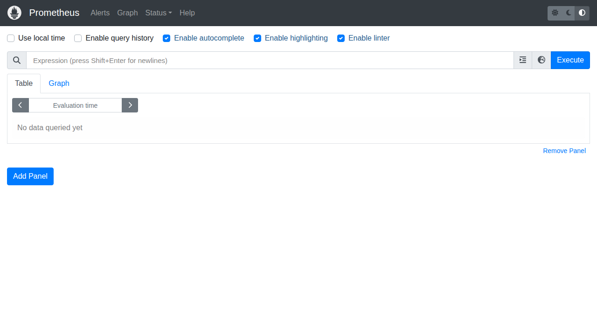
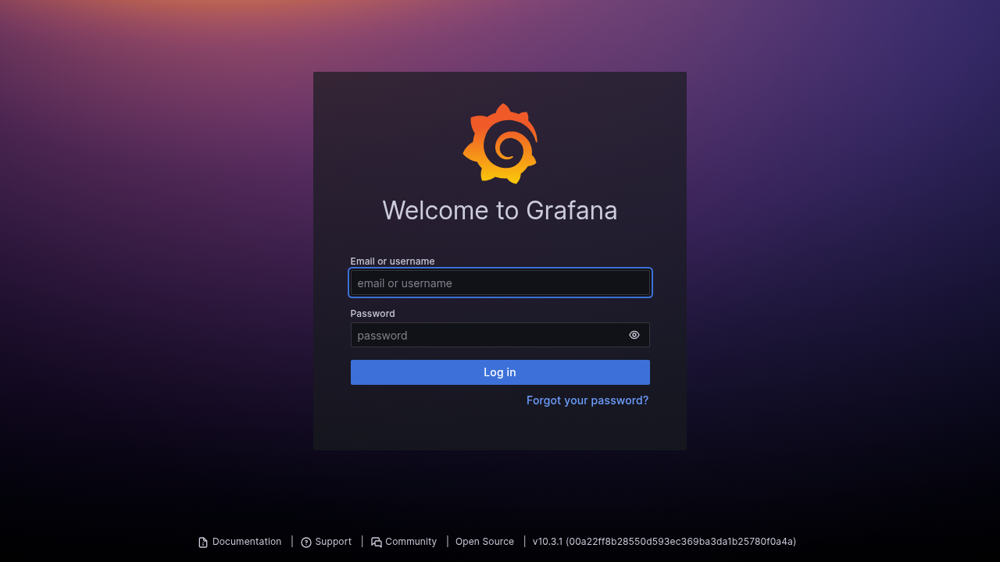
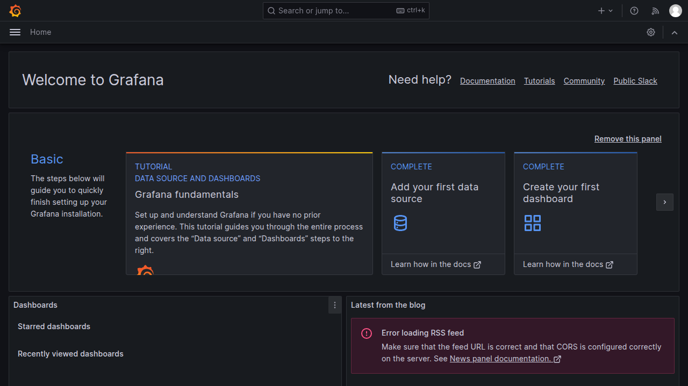
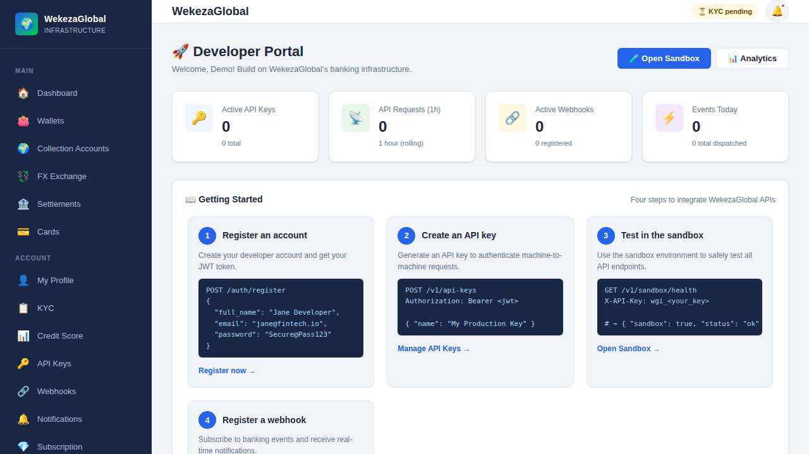

# WekezaGlobal Infrastructure — System Screenshots

These screenshots were captured from a live running stack started with `docker compose up -d`.

## Stack Versions

| Component | Version |
|---|---|
| Docker Engine | **28.0.4** |
| Docker Compose | **v2.38.2** |
| kubectl (Kubernetes CLI) | **v1.35.2** |
| Kustomize (bundled with kubectl) | **v5.7.1** |
| PostgreSQL | 16-alpine |
| Redis | 7-alpine |
| Backend (Node.js/Express) | node:20-alpine |
| Frontend (React/nginx) | nginx:alpine |
| Prometheus | v2.50.1 |
| Grafana | 10.3.1 |

## Running Services

```
NAME             IMAGE                     SERVICE      STATUS                PORTS
wgi_backend      wekezaglobal-backend      backend      Up (healthy)          0.0.0.0:3001->3001/tcp
wgi_frontend     wekezaglobal-frontend     frontend     Up (healthy)          0.0.0.0:3000->80/tcp
wgi_grafana      grafana/grafana:10.3.1    grafana      Up                    0.0.0.0:3003->3000/tcp
wgi_postgres     postgres:16-alpine        postgres     Up (healthy)          0.0.0.0:5432->5432/tcp
wgi_prometheus   prom/prometheus:v2.50.1   prometheus   Up                    0.0.0.0:9090->9090/tcp
wgi_redis        redis:7-alpine            redis        Up (healthy)          0.0.0.0:6379->6379/tcp
```

## Backend Health Check

```json
{
    "status": "ok",
    "service": "wgi-backend",
    "timestamp": "2026-03-18T19:15:14.379Z"
}
```

## Screenshots

### 1. Login Page
`http://localhost:3000/login`



---

### 2. Registration Page
`http://localhost:3000/register`



---

### 3. User Dashboard
`http://localhost:3000/dashboard`



---

### 4. Developer Portal
`http://localhost:3000/developer`


---

### 5. Sandbox Testing
`http://localhost:3000/sandbox`



---

### 6. Prometheus Metrics
`http://localhost:9090`



---

### 7. Grafana Login
`http://localhost:3003`



---

### 8. Grafana Dashboard
`http://localhost:3003/?orgId=1`



---

### 10. Developer Portal (full-page, all services healthy)
All 6 containers `(healthy)` — `docker compose ps` shows 100% green.




## Quick Start

### Docker (Linux/macOS)
```bash
cp .env.example .env
docker compose up -d
```

### Docker (Windows) — Double-click or run in PowerShell:
```powershell
.\scripts\install-windows.ps1
# or double-click:
.\scripts\install-windows.bat
```

### Kubernetes
```bash
# Apply base manifests with Kustomize
kubectl apply -k k8s/base/

# Or deploy to production overlay
kubectl apply -k k8s/overlays/production/
```

## Service Endpoints

| Service | URL | Credentials |
|---|---|---|
| Frontend Developer Portal | http://localhost:3000 | Register a new account |
| Backend API | http://localhost:3001 | JWT / API Key / OAuth2 |
| API Health Check | http://localhost:3001/health | — |
| Sandbox API | http://localhost:3001/v1/sandbox | X-API-Key header |
| Prometheus | http://localhost:9090 | — |
| Grafana | http://localhost:3003 | admin / admin |
| PostgreSQL | localhost:5432 | wgi_user / wgi_pass |
| Redis | localhost:6379 | — |
